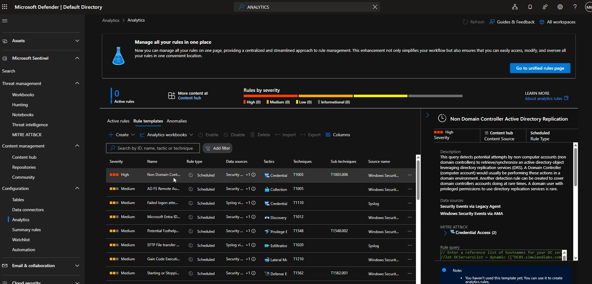
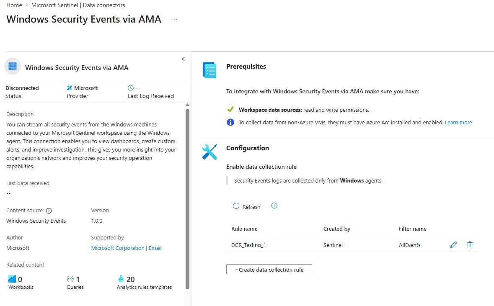
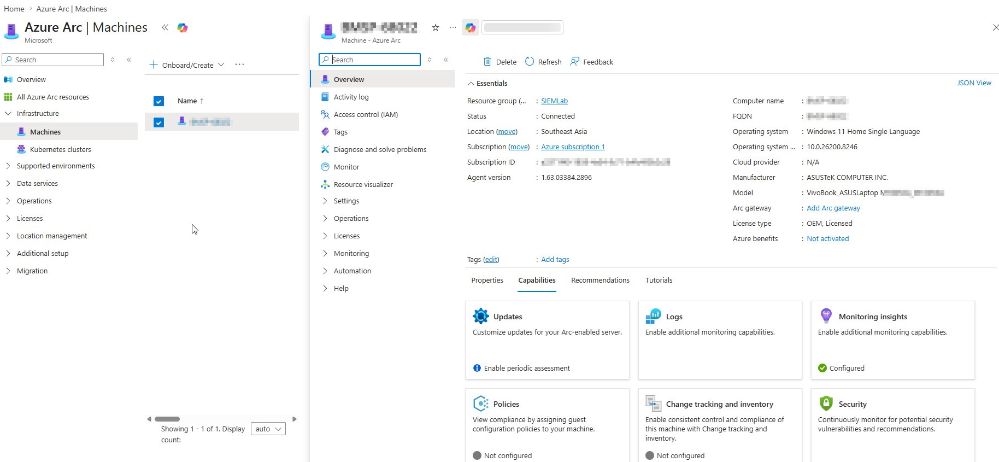
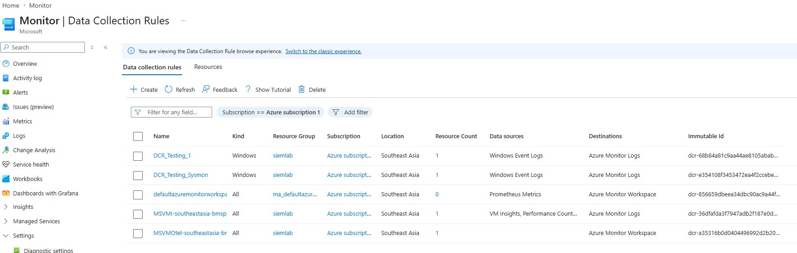
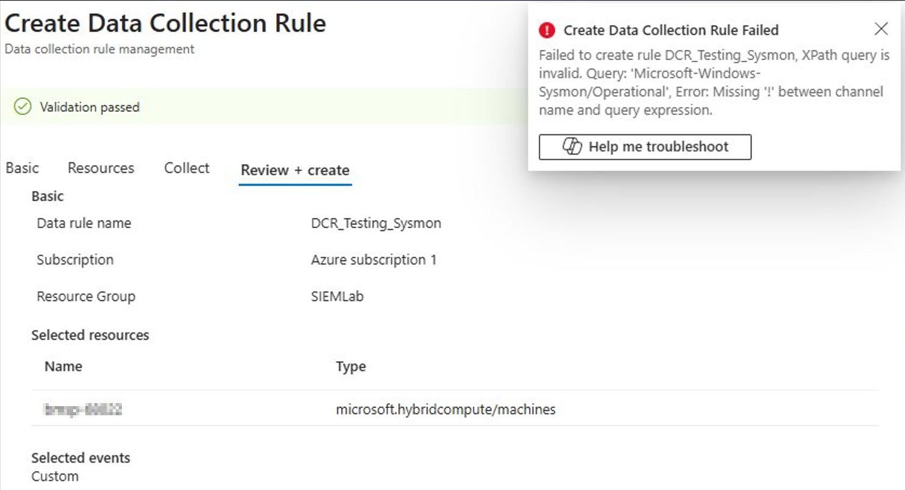
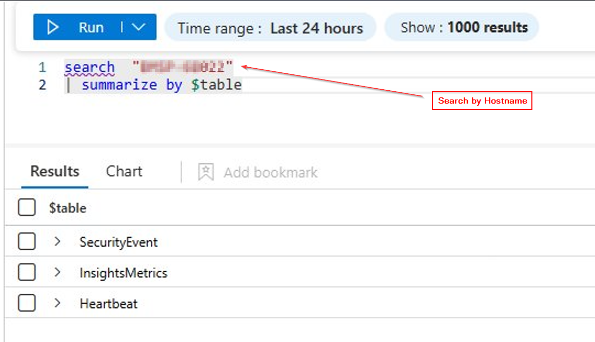
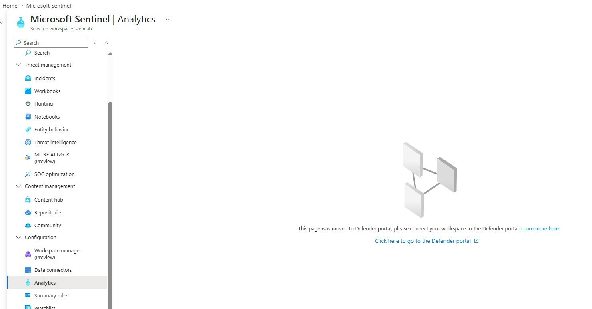

# Building a Cloud SIEM from Scratch with Microsoft Sentinel

> A hands-on walkthrough of deploying Microsoft Sentinel, onboarding a local Windows machine via Azure Arc, integrating Sysmon for deep endpoint visibility, and enabling analytics rules for automated threat detection.



---

## Table of Contents

- [Overview](#overview)
- [What We're Building](#what-were-building)
- [Phase 1: Setting Up the Foundation](#phase-1-setting-up-the-foundation)
- [Phase 2: Connecting a Local Windows Machine](#phase-2-connecting-a-local-windows-machine)
- [Phase 3: Installing Sysmon for Enhanced Visibility](#phase-3-installing-sysmon-for-enhanced-visibility)
- [Phase 4: Streaming Sysmon Logs to Sentinel](#phase-4-streaming-sysmon-logs-to-sentinel)
- [Phase 5: Enabling Analytics Rules for Threat Detection](#phase-5-enabling-analytics-rules-for-threat-detection)
- [Architecture Overview](#architecture-overview)
- [All Possible Log Collection Methods](#all-possible-log-collection-methods)
- [Troubleshooting Guide](#troubleshooting-guide)
- [What's Next](#whats-next)

---

## Overview

SIEM (Security Information and Event Management) is the backbone of any security operations team. It centralizes logs, correlates events, and detects threats in real time.

In this project, I built a fully functional SIEM lab using **Microsoft Sentinel** — Microsoft's cloud-native SIEM and SOAR platform. The setup collects Windows Security Events and Sysmon telemetry from a local Windows machine, streams them to Azure through the Azure Monitor Agent (AMA), and runs analytics rules that automatically detect suspicious activity.

This isn't a theoretical exercise. Every step documented here — including the errors and troubleshooting — comes from actually building this environment.

**Technologies used:** Microsoft Sentinel, Azure Monitor Agent, Azure Arc, Sysmon, Log Analytics Workspace, KQL, Microsoft Defender Portal

---

## What We're Building

```
Local Windows Machine
├── Windows Security Events (logins, account changes, audit)
└── Sysmon (process creation, network connections, file/registry changes)
        │
        ▼
    Azure Arc (registers machine as Azure resource)
        │
        ▼
    Azure Monitor Agent (auto-deployed via Arc)
        │
    ┌───┴───┐
    ▼       ▼
DCR 1     DCR 2
Security  Sysmon
Events    Events
    │       │
    ▼       ▼
SecurityEvent   Event
  table        table
    │           │
    └─────┬─────┘
          ▼
  Log Analytics Workspace
          │
          ▼
   Microsoft Sentinel
          │
          ▼
  Analytics Rules → Incidents → Investigation
```

---

## Phase 1: Setting Up the Foundation

### Create the Log Analytics Workspace

The Log Analytics workspace is where all log data lives. Every Sentinel deployment sits on top of one.

1. In the Azure Portal, search for **"Log Analytics workspaces"**
2. Click **+ Create**
3. Select your Subscription and create a Resource Group (e.g., `SIEMLab`)
4. Name the workspace (e.g., `siemlab`), pick a region
5. **Review + Create → Create**

### Enable Microsoft Sentinel

Once the workspace is deployed:

1. Search for **"Microsoft Sentinel"** in the portal
2. Click **+ Create** → select your workspace → **Add**

That's it. Sentinel is now active on top of your workspace.

### Configure the Data Connector

This tells Sentinel to start collecting Windows Security Events.

1. In Sentinel, go to **Data connectors** under Configuration
2. Search for **"Windows Security Events via AMA"**
3. Click **Open connector page**
4. Click **+ Create data collection rule**
5. Name it (e.g., `DCR_Testing_1`), select **All Security Events**
6. Complete the wizard



> ⚠️ **Important:** Make sure you select **"Windows Security Events via AMA"** — NOT **"Security Events via Legacy Agent."** The legacy connector uses the deprecated MMA agent that Microsoft stopped supporting in August 2024.

At this point the connector will show "Disconnected" because no machine is linked yet. That's expected.

---

## Phase 2: Connecting a Local Windows Machine

Since the Windows machine isn't an Azure VM, we need **Azure Arc** to make it visible to Azure as a managed resource.

### Onboard with Azure Arc

1. In the Azure Portal, go to **Azure Arc → Machines → + Add/Create → Add a machine**
2. Choose **"Add a single server"**
3. Fill in the details (same subscription/resource group as your workspace)
4. Click **"Generate script"** — download the PowerShell script



### Run the Onboarding Script

Open **PowerShell as Administrator** on your local machine and run the script.

If you get this error:

```
The file OnboardingScript.ps1 is not digitally signed. 
You cannot run this script on the current system.
```

Fix it with:

```powershell
Set-ExecutionPolicy -Scope Process -ExecutionPolicy Bypass
```

This only applies to your current PowerShell session — safe and temporary. Then run the script again:

```powershell
.\OnboardingScript.ps1
```

It will prompt you to authenticate with your Azure credentials. Once complete, your machine appears in Azure Arc with **"Connected"** status.

### Link the Machine to the DCR

1. Go back to **Sentinel → Data connectors → Windows Security Events via AMA**
2. Click the **edit (pencil) icon** next to your DCR
3. Go to the **Resources** tab
4. Check the box next to your Arc-enabled machine
5. **Apply**

Azure automatically deploys the AMA extension to your machine through Arc. Wait 5–10 minutes.

### Verify Logs Are Flowing

In **Sentinel → Logs**, run:

```kql
SecurityEvent
| take 10
```

If you see results, the pipeline is working. The connector status should flip to **"Connected."**

---

## Phase 3: Installing Sysmon for Enhanced Visibility

### Why Sysmon?

Standard Windows Security Events give you logins and account changes. But they miss the stuff that actually matters for threat detection:

| Capability | Security Events | Sysmon |
|---|---|---|
| Login/logoff tracking | ✅ | ❌ |
| Process creation with full command line | ❌ | ✅ (Event ID 1) |
| Network connections per process | ❌ | ✅ (Event ID 3) |
| DLL loading | ❌ | ✅ (Event ID 7) |
| File creation monitoring | ❌ | ✅ (Event ID 11) |
| Registry modifications | ❌ | ✅ (Event IDs 12/13/14) |
| DNS queries per process | ❌ | ✅ (Event ID 22) |
| Process injection detection | ❌ | ✅ (Event ID 8) |

Without Sysmon, you're blind to most of the MITRE ATT&CK framework.

### Installation (PowerShell)

Open **PowerShell as Administrator**:

```powershell
# Download Sysmon
Invoke-WebRequest -Uri "https://download.sysinternals.com/files/Sysmon.zip" `
  -OutFile "$env:USERPROFILE\Downloads\Sysmon.zip"

Expand-Archive "$env:USERPROFILE\Downloads\Sysmon.zip" `
  -DestinationPath "$env:USERPROFILE\Downloads\Sysmon"

# Download SwiftOnSecurity config (don't run Sysmon without a config — too noisy)
Invoke-WebRequest -Uri "https://raw.githubusercontent.com/SwiftOnSecurity/sysmon-config/master/sysmonconfig-export.xml" `
  -OutFile "$env:USERPROFILE\Downloads\Sysmon\sysmonconfig.xml"

# Install
cd "$env:USERPROFILE\Downloads\Sysmon"
.\Sysmon64.exe -accepteula -i sysmonconfig.xml
```

### Installation (GUI Method)

If you prefer a graphical approach:

1. Download Sysmon from [Microsoft Sysinternals](https://learn.microsoft.com/en-us/sysinternals/downloads/sysmon)
2. Extract the ZIP file
3. Download the [SwiftOnSecurity config](https://github.com/SwiftOnSecurity/sysmon-config) — click `sysmonconfig-export.xml` → Raw → Save As
4. Save the config file in the same folder as Sysmon
5. Open **Terminal as Admin** and run: `.\Sysmon64.exe -accepteula -i sysmonconfig.xml`

> **Note:** Even with the GUI method, the final install step requires an elevated terminal. Sysmon is a system driver.

### Verify Sysmon

```powershell
# Check service status
Get-Service Sysmon64

# Verify events are being generated
Get-WinEvent -LogName "Microsoft-Windows-Sysmon/Operational" -MaxEvents 5 | Format-List TimeCreated, Id, Message
```

---

## Phase 4: Streaming Sysmon Logs to Sentinel

This is where things get tricky — and where I ran into the most issues.

### The Key Concept Most Guides Miss

**The Sentinel "Windows Security Events via AMA" connector only collects from the Windows Security log.** Sysmon writes to a completely different channel (`Microsoft-Windows-Sysmon/Operational`). These are two separate pipelines:

| | Security Events Connector | Windows Event Logs DCR |
|---|---|---|
| **Configured in** | Sentinel Data Connectors | Azure Monitor → Data Collection Rules |
| **Collects from** | Windows Security log only | Any Windows event channel |
| **Sends data to** | SecurityEvent table | Event / WindowsEvent table |
| **Works for Sysmon?** | ❌ No | ✅ Yes |

This means you need a **separate DCR created in Azure Monitor** — not through the Sentinel connector.

### Create the Sysmon DCR

1. Search for **"Monitor"** in the Azure Portal → open Azure Monitor
2. Click **"Data Collection Rules"** → **+ Create**
3. **Basics:** Name it `DCR-Sysmon`, select your resource group, set Platform Type to **Windows**
4. **Resources:** Add your Arc-enabled machine
5. **Collect and deliver:** Click **+ Add data source**
   - Data source type: **"Windows Event Logs"** ← NOT "Windows Security Events"
   - Switch to the **Custom** tab
   - Enter: `Microsoft-Windows-Sysmon/Operational!*`
   - Destination: your Log Analytics workspace
6. **Review + Create**



### The XPath Gotcha

If you enter just `Microsoft-Windows-Sysmon/Operational` without the `!*`, you'll get this error:



The `!*` means "collect all events from this channel." Without it, the query is invalid.

For cost optimization, you can filter by specific Event IDs:

```
Microsoft-Windows-Sysmon/Operational!*[System[(EventID=1 or EventID=3 or EventID=11 or EventID=13 or EventID=22)]]
```

### Another Gotcha: Portal Compatibility

If you try to create the Sysmon DCR through the Sentinel data connector (instead of Azure Monitor), the rule gets created in a format that the portal can't edit later:

```
"This data collection rule contains properties that are not 
currently supported in the portal."
```

**Solution:** Always create Sysmon DCRs through **Azure Monitor → Data Collection Rules**, not through Sentinel.

### Verify Sysmon Data in Sentinel

After 5–10 minutes, check which tables are receiving data:

```kql
search "[YourMachineName]"
| summarize by $table
```



Before Sysmon: only `SecurityEvent`, `Heartbeat`, and `InsightsMetrics`. After: the `Event` table appears.

Check Sysmon event distribution:

```kql
Event
| where Source == "Microsoft-Windows-Sysmon"
| summarize count() by EventID
| sort by count_ desc
```

---

## Phase 5: Enabling Analytics Rules for Threat Detection

Without analytics rules, Sentinel is just a fancy log storage. Analytics rules are what turn it into a detection engine — they run KQL queries on a schedule and create **Incidents** when something suspicious is found.

### Accessing Analytics (Defender Portal Migration)

When you navigate to **Sentinel → Analytics** in the Azure portal, you'll see this:



Microsoft has moved Analytics to the **unified Defender portal** at [security.microsoft.com](https://security.microsoft.com). Click the link, connect your workspace if prompted, and you'll land on the analytics page.

### Enabling Rule Templates

The Defender portal has hundreds of rule templates. Filter by data sources that match your setup (**Security Events**, **Windows Security Events**).


**Rules I enabled for this lab:**

| Rule | Severity | MITRE Tactic | What It Detects |
|---|---|---|---|
| Non Domain Controller AD Replication | High | Credential Access | DCSync attack attempts |
| Security Event Log Cleared | Medium | Defense Evasion | Someone covering their tracks |
| User Added to Administrators Group | Medium | Privilege Escalation | Unauthorized privilege elevation |
| Brute Force / Failed Logon Attempts | Medium | Credential Access | Repeated failed logins |
| Potential Fodhelper UAC Bypass | Medium | Privilege Escalation | UAC bypass technique |
| Gain Code Execution via Build Events | Medium | Lateral Movement | Build system abuse |
| Starting or Stopping Windows Services | Medium | Defense Evasion | Suspicious service manipulation |

**To enable a rule:**

1. Click a rule template → review the details panel
2. Click **"Create rule"**
3. Walk through the wizard (General → Rule logic → Incident settings)
4. Defaults are fine for a lab — click **Create**

Start with 5–10 rules. You can always enable more once you understand your baseline.

---

## Architecture Overview

Here's the complete architecture of what we built:

```
┌──────────────────────────────────────────┐
│         Local Windows Machine            │
│                                          │
│  ┌─────────────────┐  ┌──────────────┐  │
│  │ Windows Security │  │   Sysmon     │  │
│  │   Event Log      │  │  (Driver +   │  │
│  │                  │  │   Service)   │  │
│  └────────┬─────────┘  └──────┬───────┘  │
│           │                    │          │
│  ┌────────┴────────────────────┴───────┐ │
│  │     Azure Monitor Agent (AMA)       │ │
│  │   (deployed via Arc extension)      │ │
│  └────────────────┬────────────────────┘ │
│                   │                      │
│  ┌────────────────┴────────────────────┐ │
│  │  Azure Arc Connected Machine Agent  │ │
│  └────────────────┬────────────────────┘ │
└───────────────────┼──────────────────────┘
                    │ HTTPS (443)
                    ▼
┌──────────────────────────────────────────┐
│              Microsoft Azure             │
│                                          │
│  ┌──────────────┐  ┌──────────────────┐ │
│  │DCR: Security │  │ DCR: Sysmon      │ │
│  │   Events     │  │                  │ │
│  └──────┬───────┘  └────────┬─────────┘ │
│         │                    │           │
│         ▼                    ▼           │
│  SecurityEvent table    Event table      │
│         │                    │           │
│         └────────┬───────────┘           │
│                  ▼                       │
│     Log Analytics Workspace (siemlab)    │
│                  │                       │
│                  ▼                       │
│        Microsoft Sentinel                │
│                  │                       │
│                  ▼                       │
│  ┌────────────────────────────────────┐  │
│  │    Analytics Rules (KQL queries)   │  │
│  │              │                     │  │
│  │              ▼                     │  │
│  │         Incidents                  │  │
│  │              │                     │  │
│  │              ▼                     │  │
│  │   Investigation & Response         │  │
│  └────────────────────────────────────┘  │
└──────────────────────────────────────────┘
```

---

## All Possible Log Collection Methods

Before building this, I researched all the ways you can get Windows logs into Sentinel. Here's the comparison:

| Method | Agent Required? | Best For | Status |
|---|---|---|---|
| **AMA + Azure Arc** ✅ | Yes (auto-deployed) | On-prem / hybrid machines | **Recommended** |
| Legacy MMA/OMS | Yes (manual) | Legacy environments | **Deprecated** |
| Windows Event Forwarding + AMA | On collector only | Large enterprise fleets (1000+ machines) | Active |
| Syslog / CEF | On forwarder only | Network devices, firewalls, Linux | Active |
| API Ingestion | No | Custom apps, IoT | Active |
| Cloud Connectors | No | SaaS / cloud services (M365, Azure AD) | Active |

**Why I chose AMA + Azure Arc:**
- It's Microsoft's current recommended approach
- Data Collection Rules allow filtering at the source (reduces cost)
- Azure Arc makes the local machine a first-class Azure resource
- AMA auto-deploys and auto-updates through Arc
- Mirrors real enterprise hybrid deployments

---

## Troubleshooting Guide

Real issues I encountered during this build:

### PowerShell Execution Policy Error

```
The file is not digitally signed. You cannot run this script on the current system.
```

**Fix:**
```powershell
Set-ExecutionPolicy -Scope Process -ExecutionPolicy Bypass
```
Session-scoped, temporary, safe.

### XPath Validation Error on DCR

```
Missing '!' between channel name and query expression.
```

**Fix:** Add `!*` after the channel name → `Microsoft-Windows-Sysmon/Operational!*`

### AzureMonitorAgent Service Not Found

```
Cannot find any service with service name 'AzureMonitorAgent'.
```

**Fix:** On Arc-managed machines, AMA doesn't run as a standalone service. It runs through `ExtensionService` and `GCArcService`. Check these instead:

```powershell
Get-Service ExtensionService, GCArcService
```

The AMA binaries live at `C:\Packages\Plugins\Microsoft.Azure.Monitor.AzureMonitorWindowsAgent\`.

### Sysmon Events Not Appearing in Sentinel

**Root cause:** Created the DCR through the Sentinel data connector instead of Azure Monitor. The Sentinel connector only handles the Security log channel.

**Fix:** Delete the DCR. Recreate it in **Azure Monitor → Data Collection Rules** with data source type **"Windows Event Logs"** (not "Windows Security Events").

### DCR Shows "Not Supported in Portal"

```
This data collection rule contains properties that are not currently supported in the portal.
```

**Fix:** Delete and recreate through Azure Monitor instead of Sentinel.

### Analytics Page Redirects

**Expected behavior.** Microsoft migrated Analytics to the Defender portal at security.microsoft.com. Connect your workspace there.

---

## What's Next

The foundation is in place. Here's what I'm planning next:

- [ ] **Custom KQL detection queries** — write rules targeting specific Sysmon events
- [ ] **Workbook dashboards** — visualize login patterns, process creation trends, network connections
- [ ] **Automation playbooks** — Logic Apps for automated incident response
- [ ] **Attack simulation** — Atomic Red Team to test detection rules end-to-end
- [ ] **Threat hunting** — proactive KQL queries using Sentinel's Hunting feature
- [ ] **Additional data sources** — Azure AD logs, Microsoft 365, DNS

---

## Tools & Resources

- [Microsoft Sentinel Documentation](https://learn.microsoft.com/en-us/azure/sentinel/)
- [Sysmon Download](https://learn.microsoft.com/en-us/sysinternals/downloads/sysmon)
- [SwiftOnSecurity Sysmon Config](https://github.com/SwiftOnSecurity/sysmon-config)
- [MITRE ATT&CK Framework](https://attack.mitre.org/)
- [KQL Quick Reference](https://learn.microsoft.com/en-us/azure/data-explorer/kql-quick-reference)

---

*Built by Martin | April 2026*
